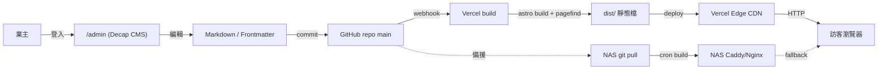
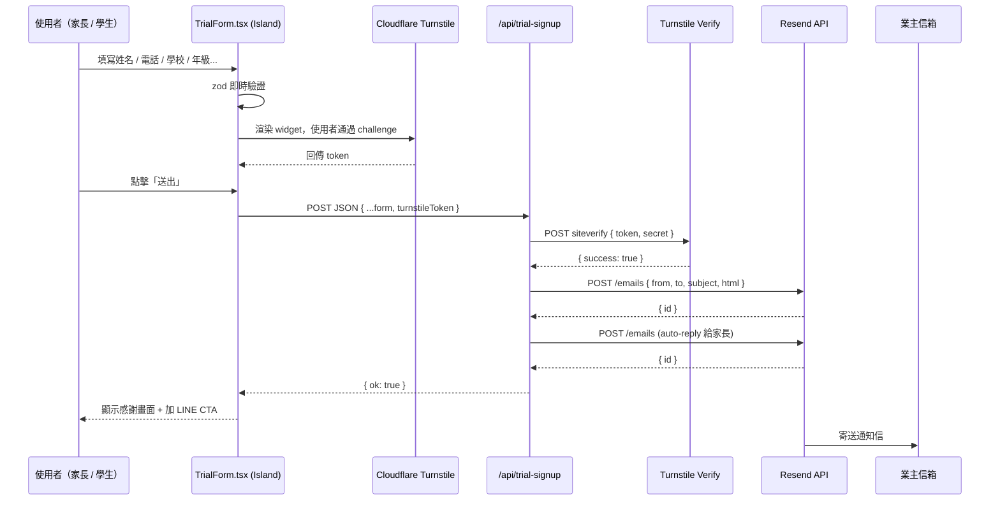
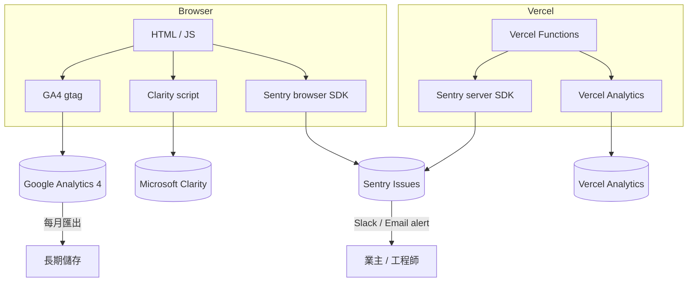
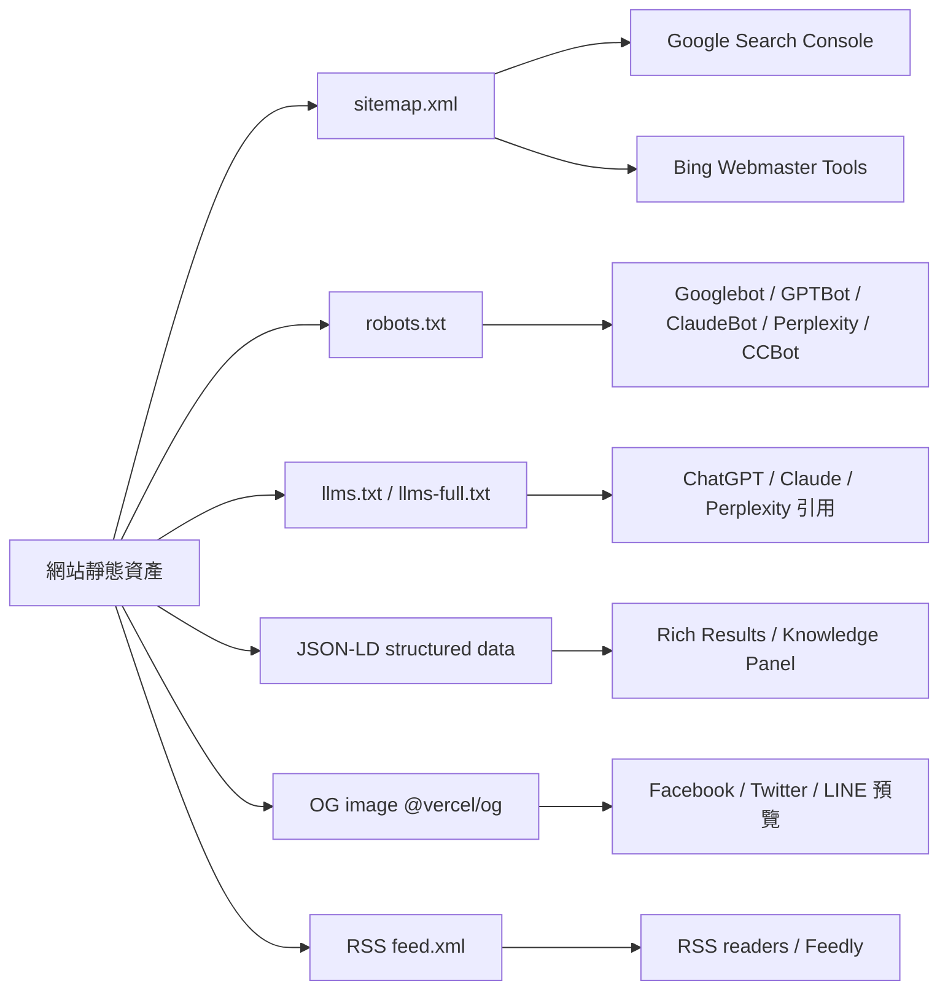
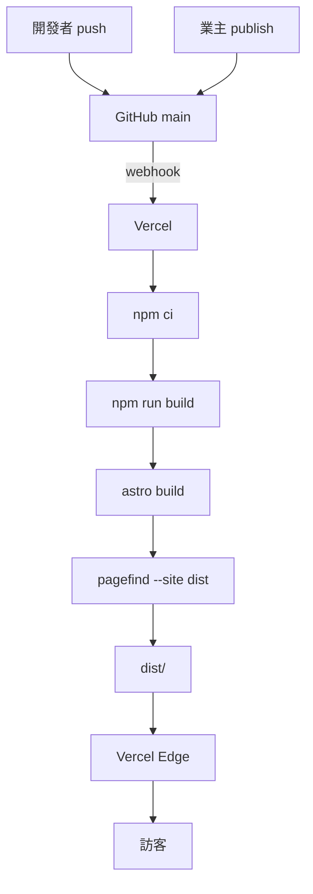

# 網站架構圖

> 對應 RFP §11.2 的「網站架構圖」交付物。彙整路由地圖、內容流、表單流與監控流。
> 本文件中 mermaid 圖在 GitHub README 預覽器與多數 Markdown viewer（Obsidian、VS Code）都可正確渲染。

---

## 1. 路由地圖

### 1.1 一階路由（v1 全交付）

```
/
├── /                           首頁
├── /about                      關於我們
├── /contact                    聯絡與位置
├── /faq                        常見問題
├── /testimonials               學生見證
├── /search                     全站搜尋
├── /404                        找不到頁面
│
├── /teachers                   師資總覽
│   └── /teachers/[slug]        師資個人頁（動態：依 src/content/teachers/*.md）
│
├── /courses                    課程總覽
│   └── /courses/[slug]         課程內頁（動態：依 src/content/courses/*.md）
│
├── /posts                      部落格列表（含分頁、tag 篩選）
│   └── /posts/[slug]           部落格內頁（動態：依 src/content/posts/*.mdx）
│
└── /lp/[campaign]              活動 Landing Page（動態：依 src/content/landing/*.md）
```

### 1.2 系統檔案

```
/sitemap-index.xml              @astrojs/sitemap 自動生成
/sitemap-0.xml
/robots.txt                     public/robots.txt（GPTBot/ClaudeBot/Perplexity allow）
/llms.txt                       public/llms.txt（品牌摘要）
/llms-full.txt                  public/llms-full.txt（內容匯總，build 時更新）
/feed.xml                       src/pages/feed.xml.ts（部落格 RSS）
/favicon.svg                    public/favicon.svg
```

### 1.3 後臺與 API

```
/admin                          public/admin/index.html（Decap CMS 入口）
/admin/config.yml               Decap 設定
/api/trial-signup               src/pages/api/trial-signup.ts（POST 表單接收）
```

---

## 2. 內容流（Content Flow）



**重點**：

1. 業主透過 Decap GUI 編輯 → Decap 用 git-gateway commit 到 GitHub `main`
2. GitHub push 觸發 Vercel webhook
3. Vercel 跑 `npm run build`（含 pagefind 索引建立）
4. 產出 `dist/` 推送到 Edge CDN
5. NAS 為備援來源，每天 cron pull + build；緊急時可切 DNS 指向

**資料延遲**：業主按下 Publish → 訪客可見，約 60-120 秒。

---

## 3. 表單流（Trial Sign-up Flow）



**安全防護**：
- Turnstile 阻擋大多 bot
- 後端 `/api/trial-signup` 二次驗證 token（不只前端帶過）
- zod schema 雙端驗證（client + server）
- 失敗會 fallback 顯示「請改用 LINE 聯絡」CTA

**目前實作狀態**：v1 為 mock 回應（見 `src/pages/api/trial-signup.ts`）；Phase 4P 接通 Turnstile + Resend 後生效。

---

## 4. 監控流（Observability）



**各監控用途**：

| 平台 | 收集 | 主要看什麼 |
|---|---|---|
| Google Analytics 4 | 流量、來源、轉換、事件 | 哪個頁面熱、CTA 點擊率、試聽表單填完率 |
| Microsoft Clarity | Heatmap、Session recording | 使用者卡在哪、是否有 rage click |
| Sentry | 錯誤回報（前後端） | console error、unhandled rejection、API 失敗 |
| Vercel Analytics | Web Vitals 真實使用者數據 | LCP / INP / CLS 是否達 RFP §8.2 標準 |

---

## 5. SEO / GEO / AI 流



**JSON-LD 對應頁面**（依 RFP §7.1）：

| 頁面 | Schema |
|---|---|
| `/` | `LocalBusiness` + `EducationalOrganization` |
| `/courses/[slug]` | `Course` + `CourseInstance` |
| `/teachers/[slug]` | `Person` + `EducationalOccupationalCredential` |
| `/posts` | `Blog` |
| `/posts/[slug]` | `Article` + `BreadcrumbList` |
| `/faq` | `FAQPage` |
| `/testimonials` | `Review` + `AggregateRating` |
| `/contact` | `LocalBusiness`（含 `geo` + `hasMap`） |

工具函式集中於 `src/lib/jsonld.ts`、`src/lib/seo.ts`。

---

## 6. 建置流程



**指令對照**：

```bash
npm run build
# 等同 astro build && pagefind --site dist
```

`pagefind` 在 Astro build 之後掃描 `dist/` 中所有 HTML，產出 `/pagefind/*.js`、`/pagefind/*.json` 索引檔，供 SearchModal 動態載入。

---

## 7. 環境隔離

| 環境 | URL | 觸發方式 | 環境變數來源 |
|---|---|---|---|
| 本機 dev | http://localhost:4321 | `npm run dev` | `.env`（個人） |
| Preview | `https://<branch>--<project>.vercel.app` | push 到非 `main` 分支 | Vercel Project → Preview env |
| Production | https://jobsedu.com.tw | merge 到 `main` | Vercel Project → Production env |
| NAS 備援 | https://jobsedu-backup.example.com | NAS cron pull + build | NAS 上的 `.env` |

---

## 8. 相依服務地圖

```mermaid
flowchart LR
    Site[賈伯斯數理教室站台]
    Site --> Vercel
    Site --> CF[Cloudflare DNS / Turnstile]
    Site --> Resend
    Site --> Sentry
    Site --> GA4
    Site --> Clarity[MS Clarity]
    Site --> GitHub
    Site --> GFonts[Google Fonts CDN]
    Site --> Vog[@vercel/og runtime]

    Decap["Decap CMS (/admin)"] --> GitHub
    Decap --> NetlifyId[Netlify Identity / GitHub OAuth]
```

**單點故障風險（SPOF）**：

| 服務 | 失效影響 | 備援 |
|---|---|---|
| Vercel | 全站不可用 | 切 DNS 到 NAS（見 NAS_DEPLOY.md） |
| Cloudflare DNS | 全站無法解析 | 預先準備 secondary DNS（如 deSEC） |
| Resend | 表單通知信無法送達 | 備援 SMTP（如 SendGrid）；或表單失敗時改顯示「加 LINE 聯絡」 |
| GitHub | CMS 無法 commit、無法部署 | 短期不影響已部署站台；長期需切換 Git host |
| Google Fonts | 字體 fallback 為系統字 | 不致命，但視覺降級；可考慮 self-host |

---

## 9. 變更紀錄

| 版本 | 日期 | 變更 |
|---|---|---|
| v1.0 | 2026-05-10 | 初版建立，對應 v1 交付 |
